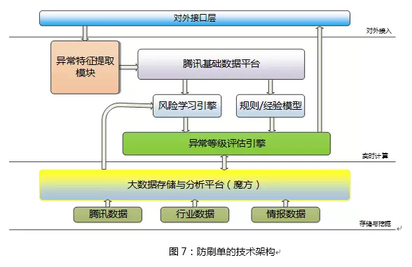
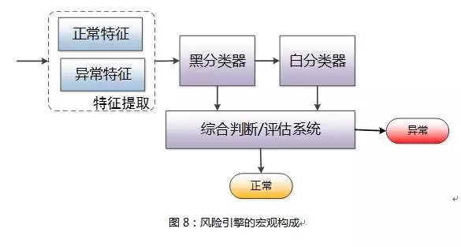
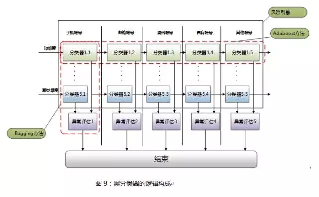
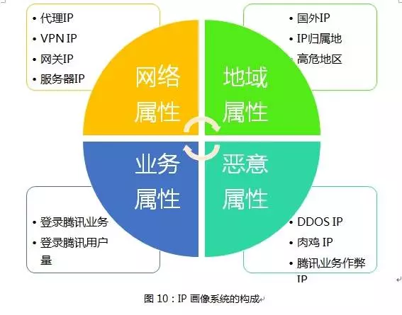
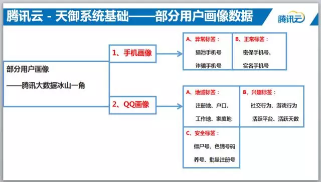
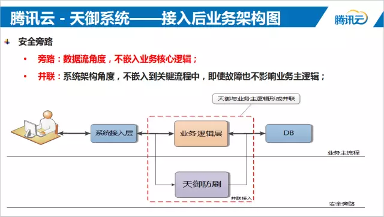

原文地址：
* [腾讯防刷负责人：基于用户画像大数据的电商防刷架构](https://mp.weixin.qq.com/s/TbZlc5t8wyG87CdHN0MtEA)

对抗刷单，一般来讲主要从三个环节入手：

1. 注册环节：识别虚假注册、减少“羊毛党”能够使用的账号量。在注册环节识别虚假注册的账号，并进行拦截和打击。
1. 登录场景：提高虚假账号登录门槛，从而减少能够到达活动环节的虚假账号量。比如，登录环节通过验证码、短信验证码等手段来降低自动机的登录效率，从而达到减少虚假账号登录量、减轻活动现场安全压力的目的。
1. 活动环节：这个是防刷单对抗的主战场，也是减少“羊毛党”获利的直接战场；这里的对抗措施，一般有两个方面：

> 1.  通过验证码（短信、语音）降低黑产刷单的效率。
> 2.  大幅度降低异常账号的优惠力度。

---

# 腾讯防刷架构

## 风险学习引擎

## 黑白分类器逻辑架构

注：白分类器主要用来识别正常用户，黑分类器识别虚假用户。

---

画像，本质上就是给账号、设备等打标签。

**用户画像 ＝ 打标签**

## IP画像

识别一个IP是不是代理IP，技术不外乎就是如下四种：

- 反向探测技术：扫描IP是不是开通了80,8080等代理服务器经常开通的端口，显然一个普通的用户IP不太可能开通如上的端口。
- HTTP头部的X_Forwarded_For：开通了HTTP代理的IP可以通过此法来识别是不是代理IP；如果带有XFF信息，该IP是代理IP无疑。
- Keep-alive报文：如果带有Proxy-Connection的Keep-alive报文，该IP毫无疑问是代理IP。
- 查看IP上端口：如果一个IP有的端口大于10000，那么该IP大多也存在问题，普通的家庭IP开这么大的端口几乎是不可能的。

## 其他画像

## 接入方法

如果识别错了正常用户不会被误伤，但是会导致体验多加了一个环节，如弹出验证码、或者人工客服核对等。

